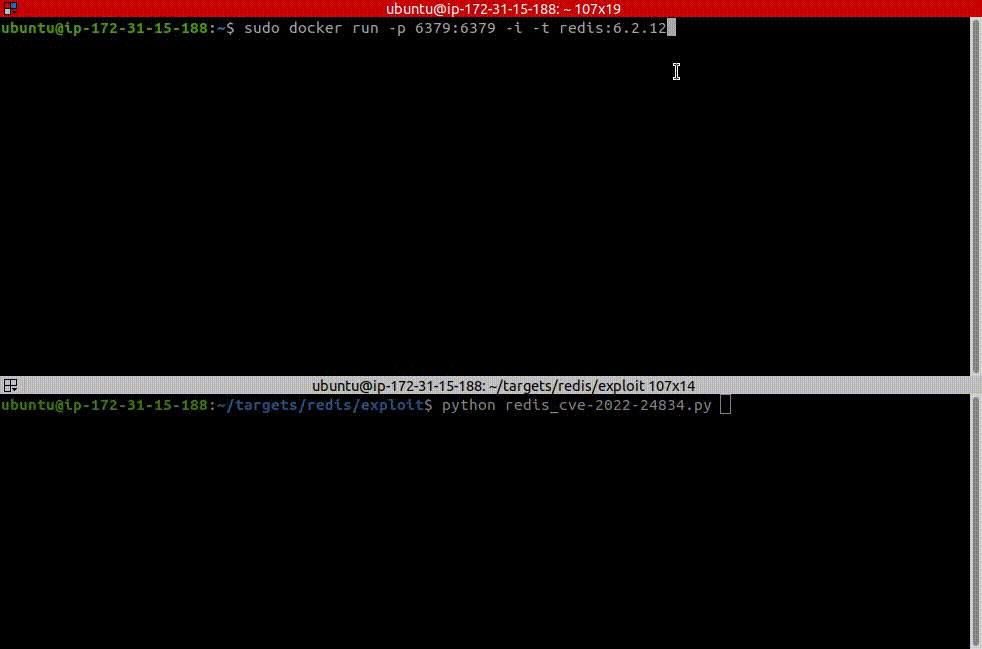
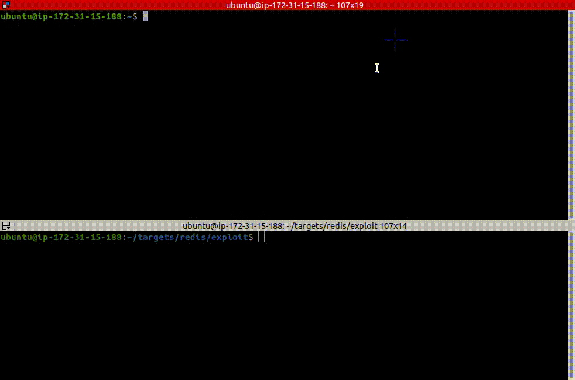

# Improvement of CVE-2022-24834 public exploit

## Author
Conviso Research Team

## Description

The team at Ricerca Security (@RicercaSec) discovered and successfully exploited a interesting vulnerability (CVE-2022-24834) in the Lua interpreter included with Redis. This vulnerability is a heap overflow in the cjson library, and a detailed writeup can be found [here](https://ricercasecurity.blogspot.com/2023/07/fuzzing-farm-4-hunting-and-exploiting-0.html).

We noticed some hard coded offsets [2] [3], which might pose a inconvenience for those who wish to test it, so we decided to remove them. The main goal was to make it more generic and learn a bit about Lua internals.

# Modifications we made

* We used a huge string to be able to read arbitrary memory addresses more easily;
* We used Lua coroutine to leak stack and libc addresses, this technique is [documented](https://saelo.github.io/posts/pwning-lua-through-load.html) by Saelo (@5aelo);
* We included a symbol resolution function (`local system_addr = resolve_symbol_gnu(libc_leak, "system")`)
* We included an auto gadget finder;
* We modified the original exploit.py to use pwntools
* We added a reverse shell handler to exploit.py

# Tests

* Redis 7.0.11 on Ubuntu 20.04 (via own compilation) - SUCCESS
* Redis 7.0.11 on Ubuntu 20.04 (via apt using Redis official repository) - SUCCESS
* Redis 7.0.11 on Ubuntu 20.04 (via docker image redis:7.0.11) - SUCCESS
* Redis 6.2.12 on Ubuntu 20.04 (via docker image redis:6.2.12) - SUCCESS
* Redis 7.0.11 on Debian 11    (via apt using Redis official repository) - SUCCESS
* Redis  5.0.7 on Ubuntu 20.04 (via apt) - CRASH

# Credits

* @RicercaSec - for the vuln, great writeup and initial exploit;
* @5aelo - for the coroutine technique.

# Demo

Version 6.2.12

Version 7.0.11

# References
[1] https://ricercasecurity.blogspot.com/2023/07/fuzzing-farm-4-hunting-and-exploiting-0.html

[2] https://github.com/RICSecLab/exploit-poc-public/blob/main/CVE-2022-24834/exploit.lua#L341

[3] https://github.com/RICSecLab/exploit-poc-public/blob/main/CVE-2022-24834/exploit.lua#L362-L365

[4] https://saelo.github.io/posts/pwning-lua-through-load.html
